# Getting Started

## Sign in

<strong>Step 1 — Open the platform</strong>

Click the link below:

<a href="https://isotms.ru" 
   style="display:inline-block;
          background-color:#007bff;
          color:white;
          padding:10px 16px;
          text-decoration:none;
          border-radius:6px;
          border:1px solid #0056b3;">
  Go to isotms.ru
</a>

Or enter manually in your browser:

isotms.ru

---

<strong>Step 2 — Login screen</strong>

After opening the site, you will see the login page:

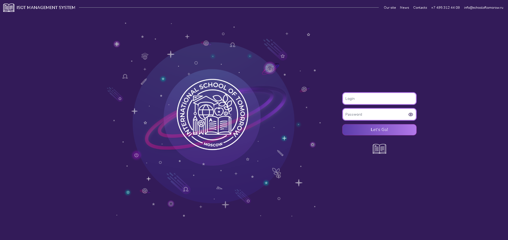

Focus on the login area:

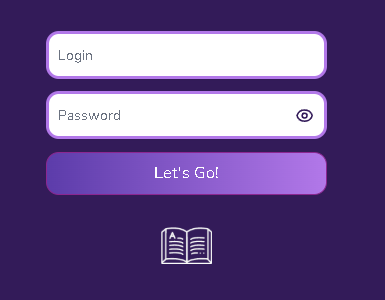

---

<strong>Step 3 — Enter credentials</strong>

In the **login field**, enter the login provided by administration:

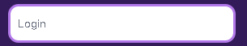

In the **password field**, enter the temporary password:

11111111

(This is a temporary password consisting of eight ones. It should be changed after first login.)

Password field reference:

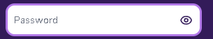

After filling both fields, the form should look like this:

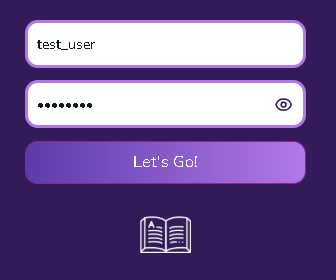

---

<strong>Step 4 — First login and password change</strong>

Click the login button:

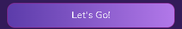

You will be redirected to the password change screen:

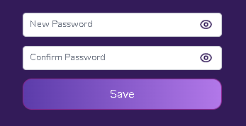

Enter a new password and confirm it in the second field.

Both fields must match.

After filling in:

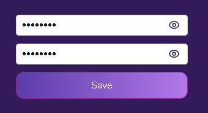

Click **Save**:

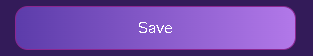

You will then be redirected to your main account dashboard.

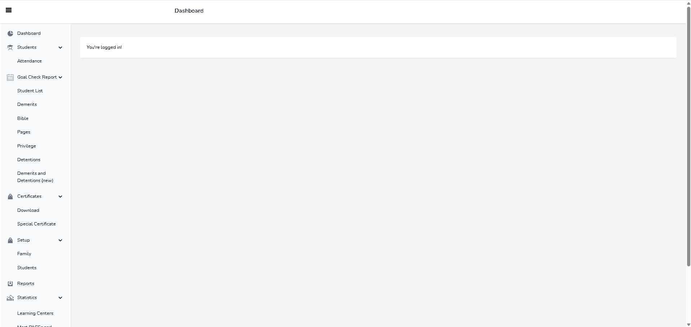

---

## Main Activities During the Day

<strong>Step 1 — Attendance</strong>

Before starting the Goal Check process, all student attendance records must be completed. To do this, click the **Attendance** button located in the left navigation panel.

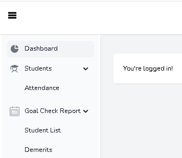

After opening the Attendance section, you will see the attendance management screen.

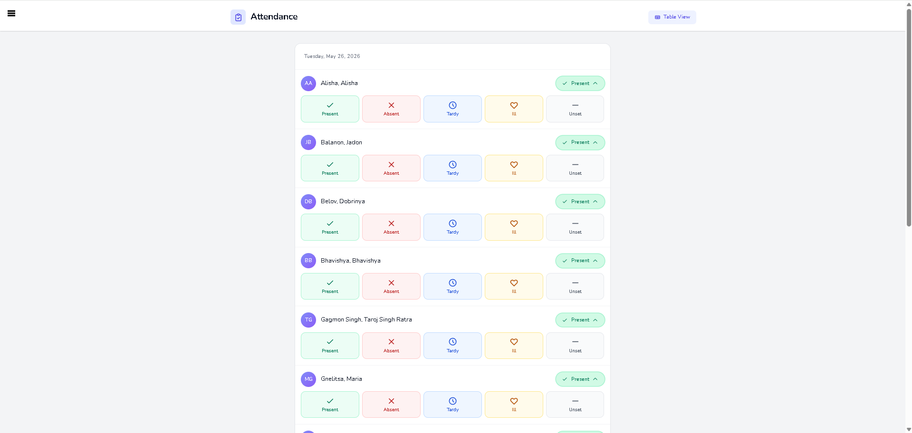

Select the appropriate attendance status for each student.

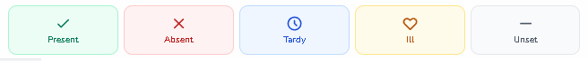

- **Present** — Student is present in class.
- **Absent** — Student is not present.
- **Tardy** — Student arrived late.
- **Ill** — Student is absent due to illness.
- **Unset** — Attendance status has not been assigned.

After completing attendance, click **Student List** in the left navigation panel, located under the **Goal Check** section, to continue with the Goal Check process.

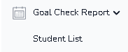

---

<strong>Step 2 — Goal Check</strong>

After opening the **Student List**, you will see the list of all students assigned to your class.

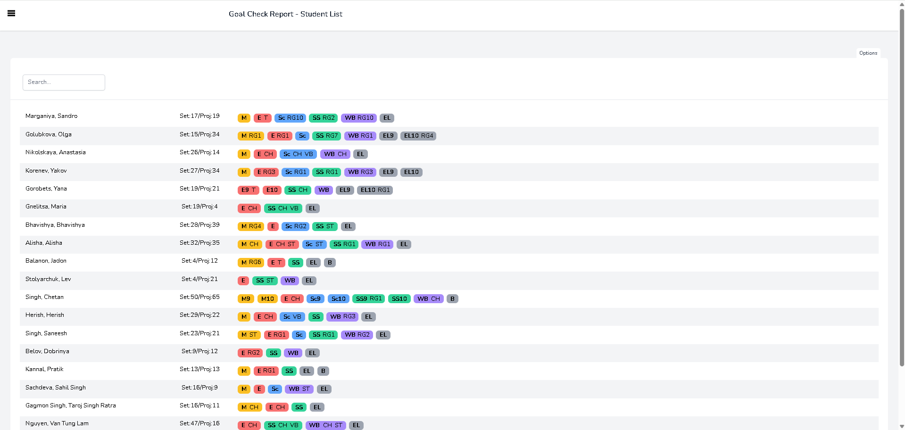

Click the **Options** button in the upper-right corner to open the display configuration menu.

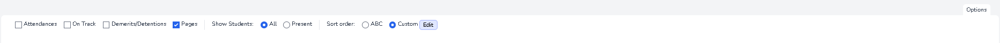

The first four checkboxes control which student information is displayed in the list.

The next option allows you to choose whether to display:
- all students, regardless of attendance status, or
- only students marked as **Present** or **Tardy**.

The final option controls the sorting method of the student list:
- alphabetical order, or
- a custom order previously configured in the system.

When all display options are enabled, the student list will appear similar to the example below.

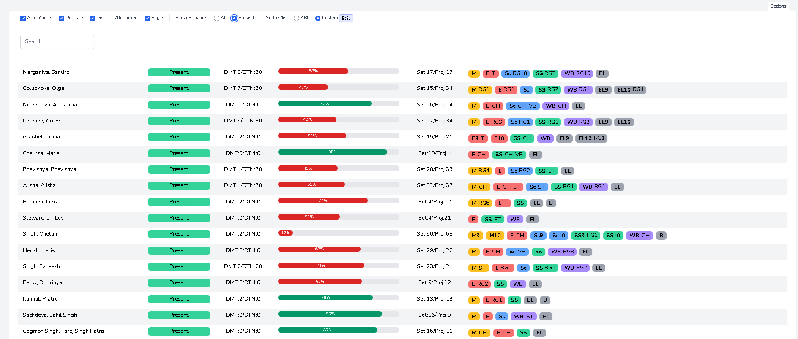

