# isotms.ru — Quick Guide

A quick start guide for accessing and using the isotms school monitoring system.

---

## Overview

isotms helps parents monitor a student’s academic progress on a daily basis.  
At the current stage, the system provides access to:

- Attendance tracking  
- Grades overview  
- Disciplinary records  

---

## Getting Started

<strong>Step 1 — Open the platform</strong>

Click the link below:

<a href="https://isotms.ru" 
   style="display:inline-block;
          background-color:#007bff;
          color:white;
          padding:10px 16px;
          text-decoration:none;
          border-radius:6px;
          border:1px solid #0056b3;">
  Go to isotms.ru
</a>

Or enter manually in your browser:

isotms.ru

---

<strong>Step 2 — Login screen</strong>

After opening the site, you will see the login page:

Focus on the login area:

---

<strong>Step 3 — Enter credentials</strong>

In the **login field**, enter the login provided in your registration letter:

In the **password field**, enter the temporary password:

11111111

(This is a temporary password consisting of eight ones. It should be changed after first login.)

Password field reference:

After filling both fields, the form should look like this:

---

<strong>Step 4 — First login and password change</strong>

Click the login button:

You will be redirected to the password change screen:

Enter a new password and confirm it in the second field.

Both fields must match.

After filling in:

Click **Save**:

You will then be redirected to your main account dashboard.

---

## Notes

- Keep your credentials secure  
- Change the temporary password immediately after first login  
- If access issues occur, contact school administration

---

## Main Dashboard

After a successful login, you will have access to the main dashboard of your account.

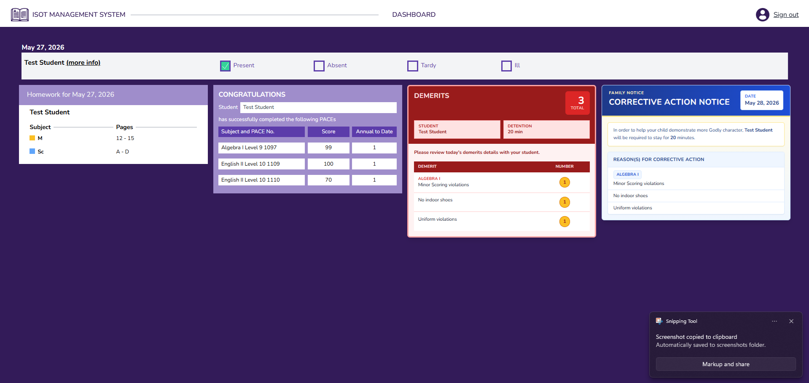

The dashboard provides a quick overview of your child’s daily academic and behavioral activity. Here you can view:

* Attendance records
* Academic performance
* Homework assignments
* Congratulations slips
* Demerits and disciplinary notices
* General school‑related updates

---

### Attendance

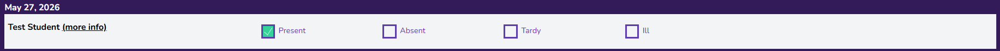

The Attendance section displays your child’s attendance status for the current day.

---

### Homework

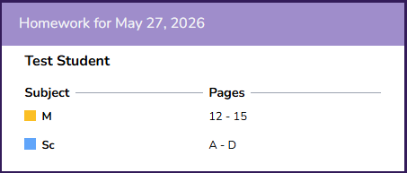

Below the Attendance section, you can find the homework assignments that were issued for the current day.

---

### Congratulations Slips

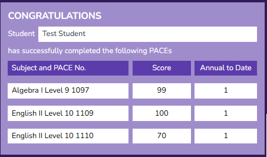

The Congratulations section displays any positive recognitions received by your child during the day. This may include completed tests, achievements, or outstanding academic performance. The subject and score will also be displayed.

---

### Demerits

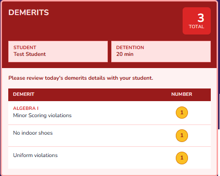

This section displays any demerits received during the day. You will be able to see:
* the reason for the demerit
* the number of demerits assigned

---

### Detention Slips

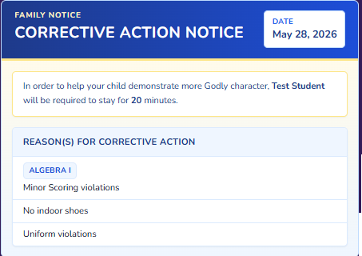

The Detention section displays disciplinary detentions assigned to your child. Information includes:
* the reason for the detention
* the detention duration in minutes
* the scheduled detention date

---

### More Information

To access more detailed information, click the **More Info** button.

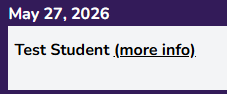

---

## Main Tabs

The system contains five main sections available through the navigation tabs.

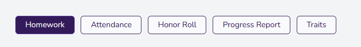

* Homework
* Attendance
* Honor Roll
* Progress Reports
* Traits

---

#### Homework

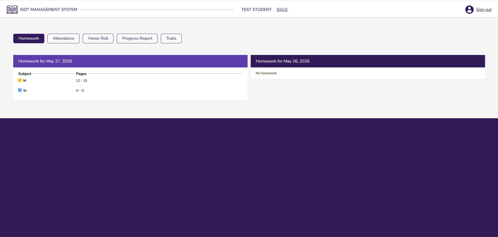

This section allows you to view homework assignments for both the current day and previous days.

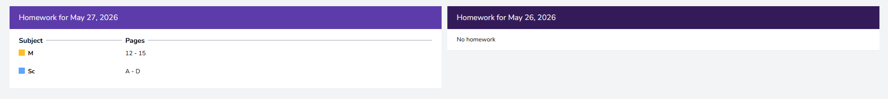
As you see in the picture above, you have a subject and corresponding pages that your child is supposed to do at home.

---

#### Attendance

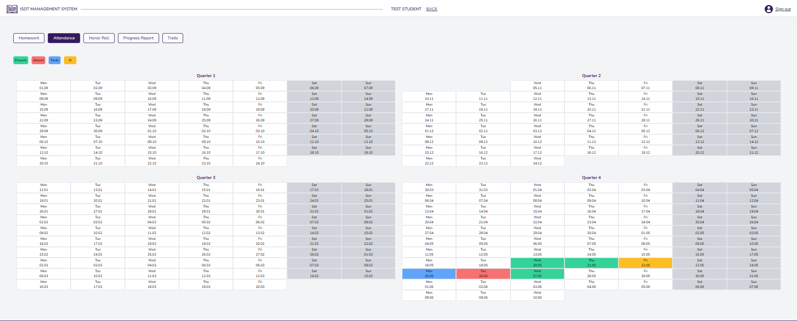

This section provides a complete attendance history for the current academic year. In the left corner you will see the legend for the colour code.

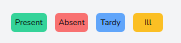

* **Present**: Student is present in class.
* **Absent**: Student is not present.
* **Tardy**: Student arrived late.
* **Ill**: Student is absent due to illness.

---

#### Honor Roll

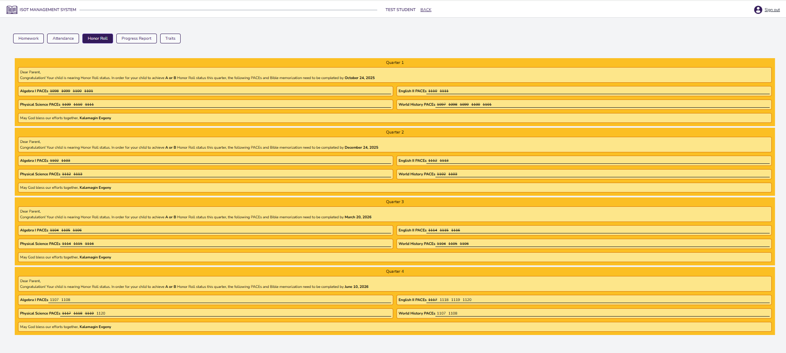

This section displays all four Honor Roll categories and the student’s academic achievements.

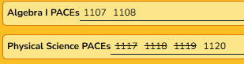

The numbers displayed after each subject represent PACEs that must be completed by the student. If a number is crossed out, it indicates that the corresponding test has already been completed.

---

#### Progress Reports

This section provides detailed academic results for your child’s PACEs and assessments.

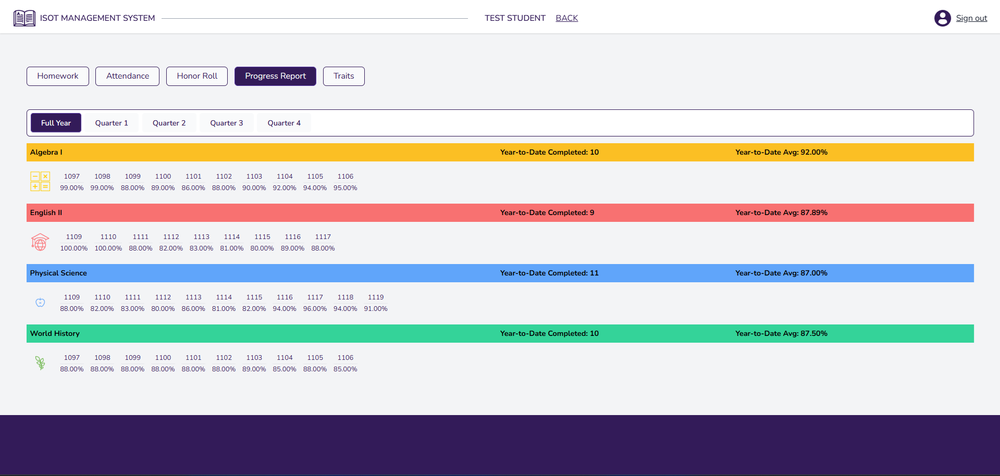
You may:
* view individual quarters separately
* review the full academic year report
* see calculated average scores at the end of each report

---

#### Traits

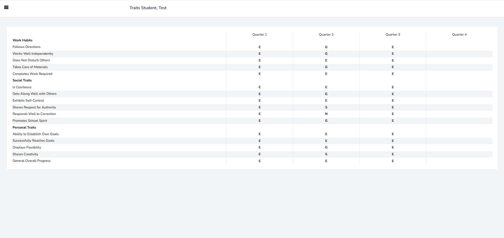

This section displays evaluations made by the supervisor regarding different areas of the student’s character, behavior, and personal development.

